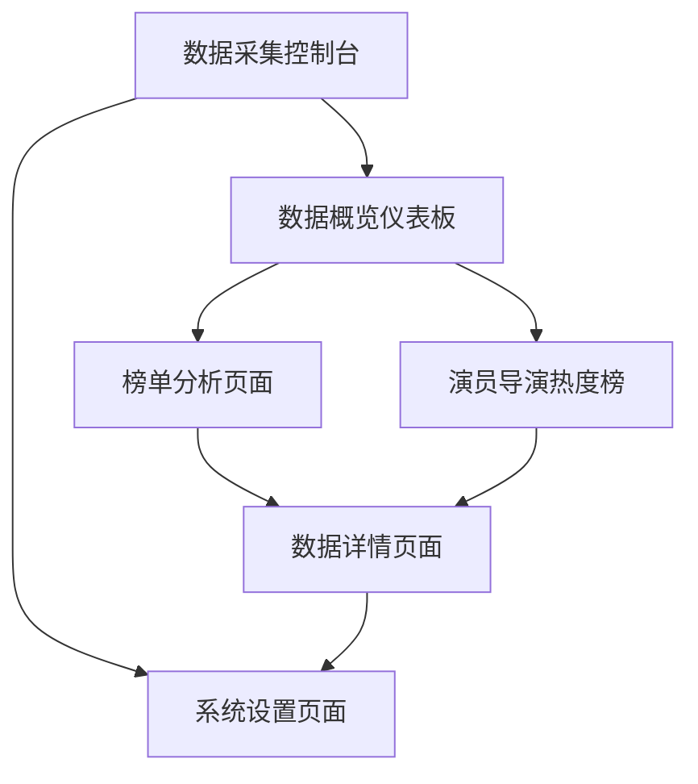

# 短剧数据收集与分析工具 - 产品需求文档

## 1. Product Overview

短剧数据收集与分析工具是一个专业的数据分析平台，专注于从主流视频平台收集短剧（微剧）数据并进行深度分析。
- 解决短剧行业缺乏统一数据分析平台的问题，为内容创作者、投资方和行业分析师提供全面的市场洞察。
- 通过智能爬虫技术整合腾讯视频、优酷、爱奇艺、抖音等平台的短剧数据，生成多维度排行榜和趋势分析报告。

## 2. Core Features

### 2.1 Feature Module

我们的短剧数据分析工具包含以下核心页面：
1. **数据采集控制台**：爬虫任务管理、数据源配置、采集进度监控
2. **数据概览仪表板**：全平台数据统计、实时更新状态、关键指标展示
3. **榜单分析页面**：跨平台榜单整合、单平台榜单展示、自定义排序规则
4. **演员导演热度榜**：男女演员热度排行、导演影响力分析、人物详情页
5. **数据详情页面**：短剧详细信息、多平台数据对比、历史趋势图表
6. **系统设置页面**：反爬策略配置、数据存储管理、导出设置

### 2.2 Page Details

| Page Name | Module Name | Feature description |
|-----------|-------------|---------------------|
| 数据采集控制台 | 爬虫任务管理 | 创建、启动、暂停、删除爬虫任务，支持定时采集和手动触发 |
| 数据采集控制台 | 数据源配置 | 配置腾讯视频、优酷、爱奇艺、抖音等平台的爬取参数和反爬策略 |
| 数据采集控制台 | 采集进度监控 | 实时显示采集进度、成功率、错误日志，支持任务重试和异常处理 |
| 数据概览仪表板 | 全平台统计 | 展示总短剧数量、更新频率、平台分布等关键指标 |
| 数据概览仪表板 | 实时状态 | 显示各平台连接状态、最近更新时间、数据新增趋势 |
| 榜单分析页面 | 跨平台榜单整合 | 识别相似榜单名称，合并多平台数据，重新排序并标注数据来源 |
| 榜单分析页面 | 单平台榜单展示 | 展示各平台独有榜单，保持原始排序，清晰标注来源平台 |
| 榜单分析页面 | 综合分析榜单 | 基于播放量、评分、更新频率等指标创建综合排行榜 |
| 演员导演热度榜 | 演员热度排行 | 分别统计男女演员出演作品数量、热度指数，生成排行榜 |
| 演员导演热度榜 | 导演影响力分析 | 统计导演作品数量、平均评分、市场表现，计算影响力指数 |
| 数据详情页面 | 短剧详细信息 | 展示短剧标题、简介、演员、导演、更新状态等完整信息 |
| 数据详情页面 | 多平台对比 | 对比同一短剧在不同平台的表现数据，包括播放量、评分等 |
| 数据详情页面 | 历史趋势分析 | 展示短剧热度变化趋势、更新节奏、用户关注度变化 |
| 系统设置页面 | 反爬策略配置 | 设置请求间隔、User-Agent轮换、代理配置等反爬参数 |
| 系统设置页面 | 数据管理 | 本地数据库管理、数据清理、备份恢复功能 |
| 系统设置页面 | 导出功能 | 支持Excel、CSV、JSON格式导出，自定义导出字段和筛选条件 |

## 3. Core Process

**主要用户操作流程：**

用户首先进入数据采集控制台配置爬虫任务和反爬策略，然后手动触发或定时执行数据采集。采集完成后，用户可在数据概览仪表板查看整体数据统计和更新状态。接下来用户可进入榜单分析页面查看跨平台整合榜单或单平台榜单，也可查看演员导演热度排行。对于感兴趣的短剧，用户可点击进入数据详情页面查看完整信息和趋势分析。最后，用户可在系统设置页面调整配置参数或导出分析数据。

## 4. User Interface Design

### 4.1 Design Style

- **主色调：** 深色背景 (#1a1a1a)，主要文字 (#ffffff)，次要文字 (#a0a0a0)
- **强调色：** 科技蓝 (#00d4ff)，成功绿 (#00ff88)，警告橙 (#ff8800)，错误红 (#ff4444)
- **按钮样式：** 扁平化设计，圆角 4px，悬停时轻微发光效果
- **字体：** 主要使用 'JetBrains Mono', 'Consolas', monospace，代码风格字体
- **布局风格：** 卡片式布局，顶部导航栏，左侧功能菜单，主内容区域网格布局
- **图标风格：** 线性图标，简洁几何形状，统一 2px 线宽

### 4.2 Page Design Overview

| Page Name | Module Name | UI Elements |
|-----------|-------------|-------------|
| 数据采集控制台 | 爬虫任务管理 | 深色卡片容器，任务状态指示灯（绿/橙/红），进度条，操作按钮组 |
| 数据采集控制台 | 数据源配置 | 标签页切换，表单输入框，开关按钮，配置预览面板 |
| 数据概览仪表板 | 统计图表 | 数字大屏风格，实时数据卡片，环形进度图，折线趋势图 |
| 榜单分析页面 | 榜单展示 | 表格布局，排名徽章，数据来源标签，筛选器，排序控件 |
| 演员导演热度榜 | 人物排行 | 头像缩略图，热度指数条形图，详情弹窗，分类标签 |
| 数据详情页面 | 详情展示 | 分栏布局，信息卡片，交互式图表，标签云，时间轴 |
| 系统设置页面 | 配置面板 | 折叠面板，滑块控件，开关按钮，代码编辑器风格文本框 |

### 4.3 Responsiveness

产品采用桌面优先设计，针对 1920x1080 及以上分辨率优化。支持平板设备适配（最小宽度 768px），移动端提供基础功能访问。界面支持鼠标悬停效果和键盘快捷键操作，提升专业用户的操作效率。