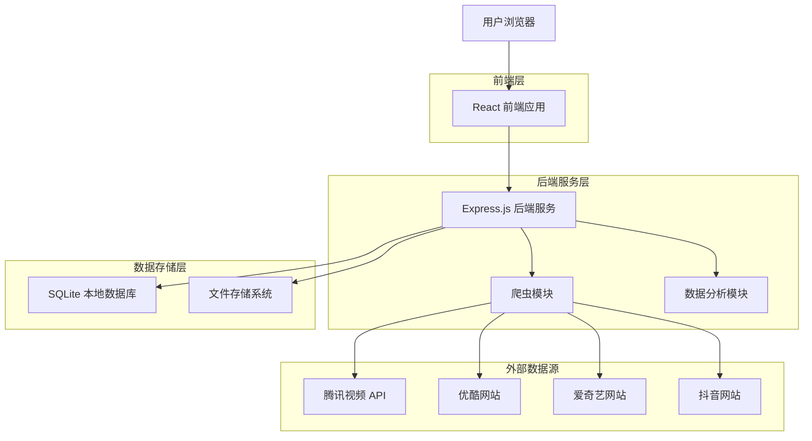
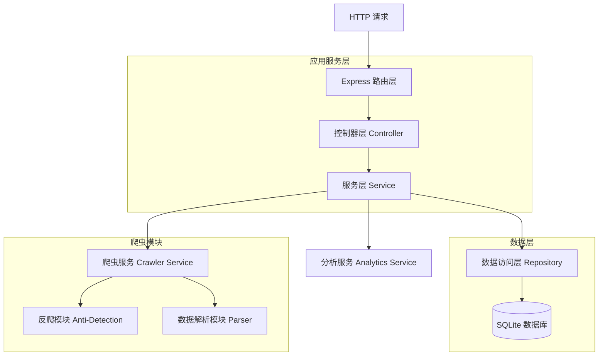
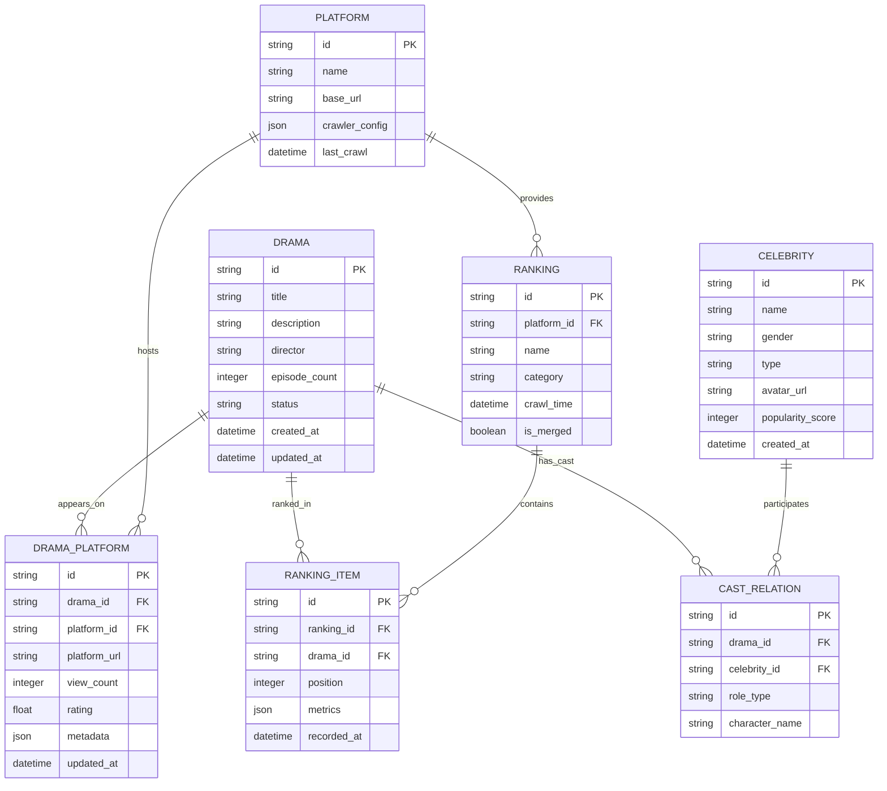

# 短剧数据收集与分析工具 - 技术架构文档

## 1. Architecture design



## 2. Technology Description

* Frontend: React\@18 + TypeScript + Tailwind CSS + Vite + Recharts

* Backend: Express\@4 + TypeScript + Node.js\@20

* Database: SQLite3 (本地文件数据库)

- Crawler: Playwright + Cheerio + Axios

  * Playwright相比Puppeteer的优势：

    * 更好的跨浏览器支持（Chrome、Firefox、Safari、Edge）

    * 更稳定的API和更少的版本兼容性问题

    * 内置的等待机制和更好的元素定位

    * 更强的调试功能和测试工具集成

    * 更好的网络拦截和模拟能力

* Storage: 本地文件系统 (JSON/CSV导出)

## 3. Route definitions

| Route        | Purpose              |
| ------------ | -------------------- |
| /            | 数据概览仪表板，显示全平台统计和实时状态 |
| /crawler     | 数据采集控制台，管理爬虫任务和配置    |
| /rankings    | 榜单分析页面，展示跨平台和单平台榜单   |
| /celebrities | 演员导演热度榜，显示人物排行和影响力   |
| /drama/:id   | 短剧详情页面，展示具体短剧的完整信息   |
| /settings    | 系统设置页面，配置反爬策略和数据管理   |

## 4. API definitions

### 4.1 Core API

**爬虫任务管理**

```
POST /api/crawler/start
```

Request:

| Param Name | Param Type | isRequired | Description                       |
| ---------- | ---------- | ---------- | --------------------------------- |
| platform   | string     | true       | 目标平台 (tencent/youku/iqiyi/douyin) |
| taskType   | string     | true       | 任务类型 (drama\_list/ranking/detail) |
| config     | object     | false      | 爬取配置参数                            |

Response:

| Param Name | Param Type | Description                             |
| ---------- | ---------- | --------------------------------------- |
| taskId     | string     | 任务唯一标识符                                 |
| status     | string     | 任务状态 (pending/running/completed/failed) |
| message    | string     | 响应消息                                    |

**获取榜单数据**

```
GET /api/rankings
```

Request:

| Param Name | Param Type | isRequired | Description |
| ---------- | ---------- | ---------- | ----------- |
| platform   | string     | false      | 筛选平台        |
| category   | string     | false      | 榜单类别        |
| merged     | boolean    | false      | 是否返回合并榜单    |

Response:

| Param Name | Param Type | Description |
| ---------- | ---------- | ----------- |
| rankings   | array      | 榜单数据列表      |
| totalCount | number     | 总数量         |
| platforms  | array      | 数据来源平台      |

**获取短剧详情**

```
GET /api/drama/:id
```

Response:

| Param Name  | Param Type | Description |
| ----------- | ---------- | ----------- |
| id          | string     | 短剧唯一标识      |
| title       | string     | 短剧标题        |
| description | string     | 短剧简介        |
| cast        | array      | 演员列表        |
| director    | string     | 导演          |
| platforms   | array      | 播放平台信息      |
| statistics  | object     | 统计数据        |

**演员导演热度**

```
GET /api/celebrities
```

Request:

| Param Name | Param Type | isRequired | Description                             |
| ---------- | ---------- | ---------- | --------------------------------------- |
| type       | string     | true       | 类型 (actor\_male/actor\_female/director) |
| limit      | number     | false      | 返回数量限制                                  |

Response:

| Param Name  | Param Type | Description |
| ----------- | ---------- | ----------- |
| celebrities | array      | 人物热度排行      |
| type        | string     | 排行类型        |
| updateTime  | string     | 数据更新时间      |

## 5. Server architecture diagram



## 6. Data model

### 6.1 Data model definition



### 6.2 Data Definition Language

**短剧表 (dramas)**

```sql
-- 创建短剧主表
CREATE TABLE dramas (
    id TEXT PRIMARY KEY,
    title TEXT NOT NULL,
    description TEXT,
    director TEXT,
    episode_count INTEGER DEFAULT 0,
    status TEXT DEFAULT 'ongoing' CHECK (status IN ('ongoing', 'completed', 'upcoming')),
    created_at DATETIME DEFAULT CURRENT_TIMESTAMP,
    updated_at DATETIME DEFAULT CURRENT_TIMESTAMP
);

-- 创建平台表
CREATE TABLE platforms (
    id TEXT PRIMARY KEY,
    name TEXT UNIQUE NOT NULL,
    base_url TEXT NOT NULL,
    crawler_config TEXT, -- JSON格式存储爬虫配置
    last_crawl DATETIME
);

-- 创建短剧平台关联表
CREATE TABLE drama_platforms (
    id TEXT PRIMARY KEY,
    drama_id TEXT NOT NULL,
    platform_id TEXT NOT NULL,
    platform_url TEXT,
    view_count INTEGER DEFAULT 0,
    rating REAL DEFAULT 0.0,
    metadata TEXT, -- JSON格式存储平台特有数据
    updated_at DATETIME DEFAULT CURRENT_TIMESTAMP,
    FOREIGN KEY (drama_id) REFERENCES dramas(id),
    FOREIGN KEY (platform_id) REFERENCES platforms(id)
);

-- 创建演员导演表
CREATE TABLE celebrities (
    id TEXT PRIMARY KEY,
    name TEXT NOT NULL,
    gender TEXT CHECK (gender IN ('male', 'female', 'unknown')),
    type TEXT CHECK (type IN ('actor', 'director', 'both')),
    avatar_url TEXT,
    popularity_score INTEGER DEFAULT 0,
    created_at DATETIME DEFAULT CURRENT_TIMESTAMP
);

-- 创建演职人员关联表
CREATE TABLE cast_relations (
    id TEXT PRIMARY KEY,
    drama_id TEXT NOT NULL,
    celebrity_id TEXT NOT NULL,
    role_type TEXT CHECK (role_type IN ('lead_actor', 'supporting_actor', 'director')),
    character_name TEXT,
    FOREIGN KEY (drama_id) REFERENCES dramas(id),
    FOREIGN KEY (celebrity_id) REFERENCES celebrities(id)
);

-- 创建榜单表
CREATE TABLE rankings (
    id TEXT PRIMARY KEY,
    platform_id TEXT,
    name TEXT NOT NULL,
    category TEXT,
    crawl_time DATETIME DEFAULT CURRENT_TIMESTAMP,
    is_merged BOOLEAN DEFAULT FALSE,
    FOREIGN KEY (platform_id) REFERENCES platforms(id)
);

-- 创建榜单项目表
CREATE TABLE ranking_items (
    id TEXT PRIMARY KEY,
    ranking_id TEXT NOT NULL,
    drama_id TEXT NOT NULL,
    position INTEGER NOT NULL,
    metrics TEXT, -- JSON格式存储评分、播放量等指标
    recorded_at DATETIME DEFAULT CURRENT_TIMESTAMP,
    FOREIGN KEY (ranking_id) REFERENCES rankings(id),
    FOREIGN KEY (drama_id) REFERENCES dramas(id)
);

-- 创建索引
CREATE INDEX idx_drama_platforms_drama_id ON drama_platforms(drama_id);
CREATE INDEX idx_drama_platforms_platform_id ON drama_platforms(platform_id);
CREATE INDEX idx_cast_relations_drama_id ON cast_relations(drama_id);
CREATE INDEX idx_cast_relations_celebrity_id ON cast_relations(celebrity_id);
CREATE INDEX idx_ranking_items_ranking_id ON ranking_items(ranking_id);
CREATE INDEX idx_ranking_items_position ON ranking_items(position);
CREATE INDEX idx_celebrities_popularity_score ON celebrities(popularity_score DESC);

-- 初始化平台数据
INSERT INTO platforms (id, name, base_url) VALUES 
('tencent', '腾讯视频', 'https://v.qq.com/channel/mini_drama'),
('youku', '优酷', 'https://www.youku.com/ku/webduanju'),
('iqiyi', '爱奇艺', 'https://www.iqiyi.com/microdrama/'),
('douyin', '抖音', 'https://www.douyin.com/series');
```

